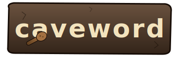

<p align="center">
  
</p>

<p align="center">
  <em>Caveman speak only one tongue. Caveword make code do same.</em>
</p>

---

## Example 1 &mdash; mixed French/English code &rarr; English only

<table>
<tr>
<th width="50%">Before</th>
<th width="50%">After</th>
</tr>
<tr>
<td valign="top">

```js
function calculerSolde(transactions) {
  let total = 0;
  for (const tx of transactions) {
    if (tx.estDébité) {
      total -= tx.montant;
    } else {
      total += tx.montant;
    }
  }
  return total;
}

const utilisateur = {
  nom: "Alice",
  ageInAnnées: 30,
};
```

</td>
<td valign="top">

```js
function calculateBalance(transactions) {
  let total = 0;
  for (const tx of transactions) {
    if (tx.isDebited) {
      total -= tx.amount;
    } else {
      total += tx.amount;
    }
  }
  return total;
}

const user = {
  name: "Alice",
  ageInYears: 30,
};
```

</td>
</tr>
</table>

`caveword scan` flags `calculerSolde`, `estDébité`, `montant`, `utilisateur`,
`nom`, and `ageInAnnées`. After triage (verdict `ro_confirmed`,
`suggested_en` filled in) the rename is yours to apply, and the verdict
sticks to the finding's signature so a rescan does not re-open it.

## Example 2 &mdash; SQL, JSON, and JSX strings stay put

Caveword masks string literals and JSX text before scanning. Database
columns, JSON tags, and user-facing labels in the source language are
**not** flagged.

<table>
<tr>
<th width="50%">Source</th>
<th width="50%">After scan</th>
</tr>
<tr>
<td valign="top">

```go
// Account mirrors the SAGA chart-of-accounts row.
type Account struct {
    Name string `json:"denumire"`
    Code string `json:"cont"`
}

func loadChartOfAccounts(db *sql.DB) ([]Account, error) {
    rows, err := db.Query(`
        SELECT cont, denumire
        FROM   CONTURI
        WHERE  rang = 'D'
    `)
    ...
}
```

```jsx
function AccountList({ items }) {
  return (
    <div>
      <h3>Lista conturilor</h3>
      {items.map(a =>
        <div key={a.code}>{a.code} — {a.name}</div>
      )}
    </div>
  );
}
```

</td>
<td valign="top">

```text
caveword scan --repo .
scanned: candidates=42 flagged=0
findings: 0   reviewed: 0   pending: 0
```

The Go field names and the function names are English; every Romanian
token sits inside a string literal or a JSX text node, both of which the
scanner masks before classification.

When an off-language identifier really does have to stay (a SQL column
mapped 1:1 to a Go struct field, an XML schema element, a test that
exercises a literal third-party label), record the verdict `domain_ok`
once and rescans treat it as accepted.

</td>
</tr>
</table>

---

## What caveword does

Caveword walks a repository, splits every identifier on
camelCase / snake\_case / kebab-case, masks string literals and
(optionally) comment text, and asks a language classifier whether the
surviving tokens look like the project's chosen target language.
Anything that does not is written to a per-repo SQLite store as a
"finding" with a stable signature (token + normalized surrounding
context).

You then triage findings into one of five verdicts:

| Verdict | Meaning |
|---------|---------|
| `ro_confirmed` | Genuinely off-language; rename. Fill `suggested_en`. |
| `en_actually` | False positive (split residue, abbreviation, etc.). |
| `proper_noun` | Person, brand, library &mdash; leave alone. |
| `domain_ok` | Off-language but accepted (DB column, third-party schema). |
| `ambiguous` | Cannot decide from this snippet. |

Verdicts are keyed by the finding's signature, so a rescan after
unrelated edits carries verdicts forward automatically. Renames or
small context shifts within the same file fall through to a fuzzy carry
(token Levenshtein &le; 2 or identical normalized-context hash) so a
function moving across the file does not re-open its review.

## Multi-language setup

Caveword ships with English embedded as the default target. Pick any
other pair from the supported list and drop a wordlist into
`<repo>/.caveword/dicts/dict_<code>.txt` (or `~/.caveword/dicts/`
to share across all your repos).

Configure the project once via `<repo>/.caveword/config.json`:

```json
{
  "target": "en",
  "detect": ["ro", "fr"],
  "margin": 0.30,
  "min_token_len": 4,
  "allowlist": ["cif", "anaf", "saga"],
  "stopwords": ["stderr", "regex"]
}
```

Or pass everything on the command line:

```bash
caveword scan --target en --detect ro,fr --margin 0.30
```

### Supported language codes

`en`, `ro`, `fr`, `de`, `es`, `it`, `pt`, `nl`, `pl`, `ru`, `uk`, `cs`,
`sk`, `hu`, `tr`, `sv`, `no`, `da`, `fi`, `el`, `bg`, `hr`, `sr`, `sl`,
`lt`, `lv`, `et`, `ja`, `ko`, `zh`, `ar`, `he`, `fa`, `hi`, `th`, `vi`,
`id`, `ms`. Adding more is one line in `internal/detect/lang.go`
(any language Lingua supports works).

### Where to get wordlists

Each language dictionary should be a UTF-8 text file with one
lower-case word per line. Common, freely-licensed sources:

| Code | Language | Source |
|------|----------|--------|
| `en` | English | embedded ([dwyl/english-words](https://github.com/dwyl/english-words) `words_alpha.txt`) |
| `ro` | Romanian | extract from [LibreOffice ro_RO Hunspell](https://github.com/LibreOffice/dictionaries/tree/master/ro_RO) — keep the lemma column, drop affix flags |
| `fr` | French | [Lifo / hunspell-fr](https://github.com/grappa-team/grappa/blob/master/grappa-debugger/src/main/resources/com/github/parboiled1/grappa/debugger/csveditor/csveditor.fxml) or `hunspell-fr` lemma list |
| `de` | German | [hunspell-de](https://github.com/wooorm/dictionaries/tree/main/dictionaries/de) `index.dic`, strip flags |
| `es` | Spanish | [hunspell-es](https://github.com/wooorm/dictionaries/tree/main/dictionaries/es), same |
| `it` | Italian | [hunspell-it](https://github.com/wooorm/dictionaries/tree/main/dictionaries/it) |
| `pl` | Polish | [hunspell-pl](https://github.com/wooorm/dictionaries/tree/main/dictionaries/pl) |
| `ru` | Russian | [hunspell-ru](https://github.com/wooorm/dictionaries/tree/main/dictionaries/ru) |
| any | any | `aspell --lang=<code> dump master` from a system aspell install |

For a Hunspell `.dic` file, drop everything after the first `/` on each
line (those are affix flags), lower-case, and strip duplicates:

```bash
sed -e 's:/.*::' -e '1d' index.dic | tr 'A-Z' 'a-z' | sort -u > dict_de.txt
mkdir -p ~/.caveword/dicts
mv dict_de.txt ~/.caveword/dicts/
```

Files in `<repo>/.caveword/dicts/` win over the user-global ones, so
you can pin a curated wordlist per repo and let the user-global
fallback cover everything else.

## (Programming) Languages parsed

| Ext | Extractor |
|-----|-----------|
| `.go` | `go/parser` (full AST) |
| `.ts .tsx .js .jsx .mjs .cjs` | regex + JSX-text masking on tsx/jsx |
| `.py` | regex + triple-string handling |
| `.rb` | regex |
| `.java .c .cc .cpp .h .hpp .cs .rs .swift .kt .scala .php` | C-family regex |

Identifiers, comments, **and path tokens** (directory names, file
basenames) are all classified. Strings are masked by language-aware
regular expressions (Go uses the standard library AST, which handles
strings natively).

## Install

```bash
go install github.com/cristian-sima/caveword/cmd/caveword@latest
```

Pure-Go dependencies only &mdash; no cgo, no native libraries to ship.

## Usage

```text
caveword scan   [--repo PATH] [--diff BASE] [--ext .go,.ts,...] [--kinds ident,path]
                [--target en] [--detect ro,fr] [--margin 0.30] [--min-len 4]
                [--dry-run] [-v]
caveword export [--repo PATH] [--limit N] [-o FILE]
caveword apply  [--repo PATH] [-i FILE] [--reviewer NAME]
caveword status [--repo PATH]
caveword list   [--repo PATH] [--pending] [--limit N]
caveword dump   [--repo PATH] [--only reviewed|pending|all] [-o FILE]
```

State lives in `<repo>/.caveword/verdicts.db` (SQLite). Add `.caveword/`
to `.gitignore` &mdash; verdicts are per-developer state, not source to
commit.

### A typical first pass

```bash
cd my-project
caveword scan --repo . --dry-run     # confirm scan scope (no node_modules etc.)
caveword scan --repo . -v
caveword status --repo .
caveword export --repo . --limit 50 -o batch.json
# review batch.json — fill in verdict + suggested_en + note
caveword apply --repo . -i batch-reviewed.json --reviewer human
```

### As a PR gate

```bash
caveword scan --repo . --diff main
caveword export --repo . --limit 100 -o batch.json
```

`--diff <base>` only re-scans files changed against the given branch, so
running this in CI on each PR is cheap.

### Filtering kinds

Findings carry a `kind` field: `ident`, `comment`, or `path`. Comments
generate a lot of noise in repos that intentionally mix languages
(English code, native-language documentation), so the default scan keeps
only `ident,path`. Include comments with:

```bash
caveword scan --repo . --kinds ident,comment,path
```

## How findings stay stable

A finding's signature is `sha256(token + normalized_context)` where
`normalized_context` is the surrounding &plusmn;2 lines with whitespace
stripped. Adding a function above, renaming an unrelated variable, or
reformatting blank lines does not change the signature, so verdicts
carry over.

When the signature does change (the token itself was renamed, or the
two-line neighbourhood was rewritten), the store falls back to a fuzzy
match scoped to the same file: identical context hash *or* token
Levenshtein &le; 2 inherits the prior verdict and records the
`carried_from` link.

## What is filtered out before classification

- Hidden directories, `node_modules`, `vendor`, `dist`, `build`, `target`,
  `.next`, framework caches, `wailsjs`, `public`, `static`, `assets`,
  `testdata`, &hellip;
- Generated / lock files: `package-lock.json`, `go.sum`, `*.min.js`,
  `*.bundle.js`, `*.map`, `*.pb.go`, `*.gen.go`, `*.lock`, &hellip;
- Files larger than 512 KiB.
- Words present in the target-language dictionary.
- A small list of stop-words (acronyms, tech tokens like `stderr`,
  `sqlite`, `regex`, &hellip;) shared across languages.
- A tiny project allowlist for product / brand short codes.

The allowlist is intentionally short. Domain-specific tokens are
recorded as `domain_ok` per finding, not blanket-suppressed &mdash;
that way, a real off-language identifier that happens to share a name
with a domain term still surfaces.

## Layout

```
caveword/
  cmd/caveword/main.go       # CLI: scan / export / apply / status / list / dump
  internal/
    config/                  # JSON config loader (.caveword/config.json)
    detect/                  # lingua-go + dictionaries + allowlist + stopwords
    extract/                 # parsers, tokenizer, ignore filter
    store/                   # SQLite, sig, fuzzy-carry
    diff/                    # git ls-files + git diff modes
    review/                  # JSON export / apply
  assets/logo.svg
```

## Stack

- Go 1.22
- [`github.com/pemistahl/lingua-go`](https://github.com/pemistahl/lingua-go) &mdash; language classifier
- [`modernc.org/sqlite`](https://gitlab.com/cznic/sqlite) &mdash; pure-Go SQLite (no cgo, Windows-friendly)
- [`dwyl/english-words`](https://github.com/dwyl/english-words) `words_alpha.txt` &mdash; embedded English dictionary

## License

MIT &mdash; see [LICENSE](LICENSE).
